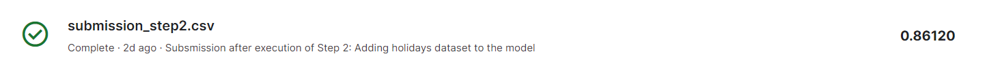
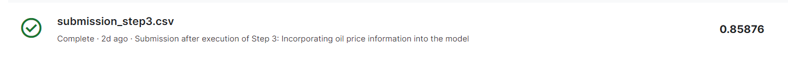
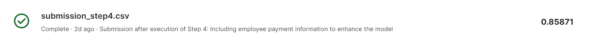
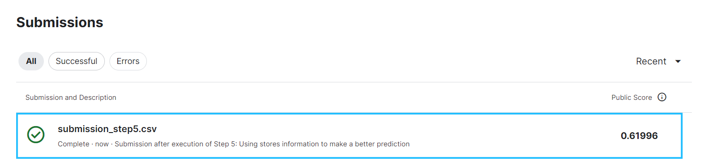

### Project 2: Store Sales - Time Series Forecasting
#### Score: 0.61996

- **Folder**: `project2`
- **Objective**: Forecasting store sales using time series data to predict future sales accurately.
- **Data Source**: This project uses the "Store Sales - Time Series Forecasting" dataset from Kaggle. (The entries were zipped to fit into Git.)
  - `holidays_events.csv`: Contains information about holidays and events.
  - `oil.csv`: Contains historical oil price data.
  - `sample_submission.csv`: Submission example downloaded from Kaggle.
  - `stores.csv`: Contains information about different stores.
  - `test.csv`: Test sample downloaded from Kaggle.
  - `train.csv`: Train sample downloaded from Kaggle.
  - `transactions.csv`: Contains transaction data for each store.

- **Notebooks**:
  - `explore.ipynb`: First look and all data samples.
  - The general strategy of the first fours steps was to create a model for each store, adding information to these models over the steps.
    - `step1.ipynb`: Forecasting using only the train dataset.
    - `step2.ipynb`: Adding holidays dataset to the model.
    - `step3.ipynb`: Incorporating oil price information into the model.
    - `step4.ipynb`: Including employee payment information to enhance the model.
  - In step 5, a new strategy is adopted where a model for each family is created
    - `step5.ipynb`: Using stores information to make a better prediction.

- **Data Subfolders**:
  - Inside the `data` folder, there is a subfolder for each step (`step1`, `step2`, `step3`, `step4`, `step5`) containing:
    - Auxiliary CSVs created during the execution of the respective notebook.
    - Results obtained for the variations generated using two algorithms: Random Forest Regressor and Gradient Boosting Regressor `results.csv`.

- **Submissions Folder**:
  - The `submissions` folder contains:
    - `submission_step_1.csv`: Submission for the best results from the step 1
    
    - `submission_step_2.csv`: Submission for the best results from the step 2
     
    - `submission_step_3.csv`: Submission for the best results from the step 3
    
    - `submission_step_4.csv`: Submission for the best results from the step 4
    
    - `submission_step_5.csv`: Submission for the best results from the step 5
    
